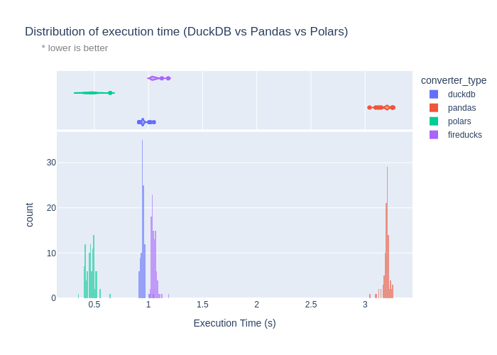

# DuckDB/Polars/Pandas File Conversion Benchmark 🦆🐻‍❄️🐼

Comparison of file conversion between duckdb, polars and pandas.

> On average, duckdb is ~3x faster than pandas, polars is ~3x faster than duckdb and ~10x faster than pandas.

```txt
Running [100] iterations of the simulation...
  converter_type  duration
                      mean       std       min       max    median
0         duckdb  0.638409  0.017433  0.627250  0.738895  0.633449
1         pandas  1.842512  0.027998  1.818738  2.007856  1.836374
2         polars  0.190853  0.014131  0.171845  0.281984  0.186804
Results saved to [data/simulation_results.json]
Plot saved to [img/plot.png]
Complete! Total time: [268.05s]
```



Simulation results based on 100 iterations and 100k rows sampled from the machine learning subset of the [MMLU dataset](https://huggingface.co/datasets/lighteval/mmlu) `lighteval/mmlu`.

## Requirements

```bash
pip install -r requirements.txt
```

## Usage

### DuckDB script

Standalone script - also includes checking if the system has the necessary dependencies.

```bash
./file-converter.sh <input_file> -f <output_format> [-o <output_file>] [-v]
```

### Pandas script

```bash
python file_converter.py <input_file> -f <output_format> [-o <output_file>] [-v]
```

### Polars script

Standalone script - also includes checking if the system has the necessary dependencies.

```bash
./polars-converter.sh <input_file> -f <output_format> [-o <output_file>] [-v]
```

### Simulation

To run the simulation:

```bash
# Download dataset
python download_dataset.py

# Run simulation
python 3way_simulation.py
```

## Notes

- This is not intended to be an exhaustive benchmark, and originally started from the `./file-converter.sh` script.
- The `3way_simulation.py` script is a more controlled and isolated comparison of file conversion between duckdb, polars and pandas.
- It also generates a plot of the results as seen above.
